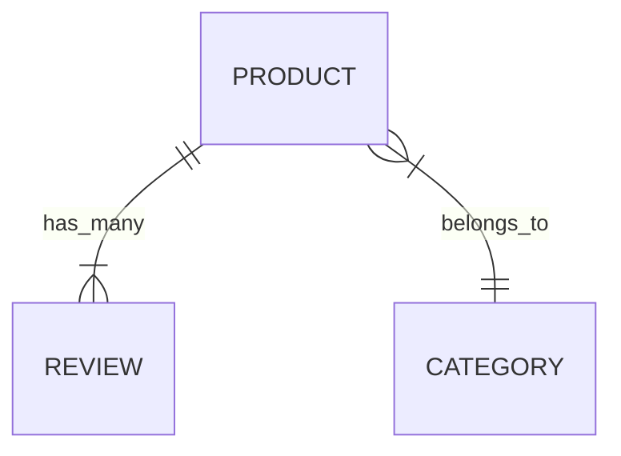

# book store

## ERD

```mermaid
erDiagram
    PRODUCT ||--|{ REVIEW : has_many
    PRODUCT }|--|| CATEGORY : belongs_to
```

## Setup
- `bundle install`
- `rails db:create db:migrate`
- `rails server`
- open `http://localhost:3000`
